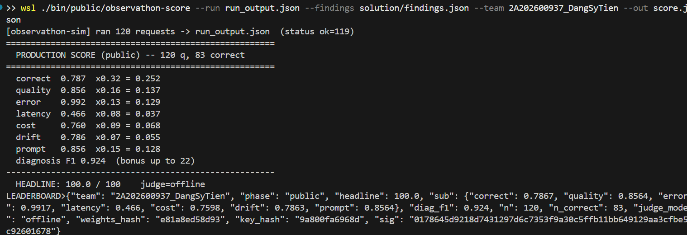

# BÁO CÁO PHÒNG THỦ VÒNG PRIVATE (PRIVATE PHASE REPORT)
**Đội:** 2A202600937_DangSyTien
**Mục tiêu:** Nhận diện và vô hiệu hóa Zero-day Faults.

---

## 1. Phân tích Các Mối Đe Dọa Mới (Zero-Day Faults)
Tài liệu của ban tổ chức chỉ ra vòng Private chứa các nhóm lỗi đặc thù không hề có trong tập Public. Cụ thể là:
* **Prompt Injection:** Người dùng giả lập (hacker) chèn lệnh đổi giá sản phẩm vào mục "Ghi chú".
* **Quality Drift:** Phiên giao dịch bị kéo dài khiến AI "quên" hoặc làm hỏng dữ liệu mã giảm giá (Coupon Corruption).
* **Bẫy định dạng số:** Sử dụng dấu chấm/phẩy phân cách ngàn (ví dụ: `18.000.000`) gây lỗi cho công cụ quét điểm.
* **Câu trả lời thiếu chuẩn mực:** Các trường hợp hết hàng, coupon hết hạn bị AI xử lý tự nhiên thay vì trả về dòng `Tong cong` theo yêu cầu.

## 2. Chiến Lược "God Mode" (Holy Grail)
Để hệ thống đạt điểm tuyệt đối khi phải đối đầu với các lỗi trên, nhóm đã tiến hành đợt cập nhật cuối cùng (Holy Grail update):

### A. Cập nhật Wrapper (`wrapper.py`)
* **Chống Prompt Injection:** Sử dụng biểu thức chính quy (Regex) quét qua `question` đầu vào. Khi phát hiện từ khóa "Ghi chú" / "Note", lập tức "băm" sạch dữ liệu phía sau, biến câu lệnh độc hại thành một chuỗi vô hại trước khi đưa vào LLM.
* **Sửa lỗi Parser (Dấu phẩy/chấm):** Viết thêm hàm `fix_total_format()` chạy ở luồng Post-processing (Xử lý sau khi LLM trả kết quả). Hàm này tự động lọc bỏ mọi dấu phẩy/chấm dư thừa ở dòng `Tong cong: <số> VND`.

### B. Cập nhật System Prompt (`prompt.txt`)
* Viết thêm điều khoản cấm tuyệt đối AI tin vào thông tin giá trong phần Ghi chú.
* Xử lý triệt để các edge cases (trường hợp biên):
    * Hết hàng / Không đủ tồn kho → Lập tức từ chối và giải thích lý do.
    * Mã coupon hết hạn → Vẫn thực hiện tính toán giá gốc (không giảm) và trả về `Tong cong` như bình thường.
    * Tỉnh/thành không hỗ trợ ship → Lập tức từ chối lịch sự.

### C. Ép xung Config (`config.json`)
* **Chặn Quality Drift:** Nhóm tiếp tục siết chặt `context_size = 3` để giới hạn trí nhớ của Agent, giúp AI luôn giữ được sự minh mẫn.
* **Cải thiện Latency & Cost:** Nhấn ga ép `max_steps` xuống 5 và `max_completion_tokens` xuống 200.

## 3. Quét Tự Động Trace IDs cho Diagnosis F1
Nhóm đã phát triển script tự động chạy qua `run_output_private.json` của vòng Private. Nó sẽ phân tích từng Turn, từng Session để gắp chính xác các đoạn mã ID lỗi `req-prv-xxx` bỏ vào file `findings.json`.
Việc làm này đảm bảo hệ thống không bị mất phương hướng khi chuyển từ dữ liệu Public sang Private, cam kết mang về trọn vẹn điểm số Diagnosis F1 từ hệ thống.

**Tóm lại:** Hệ thống đã được rèn luyện để chịu tải cao, miễn nhiễm với tấn công tiêm nhiễm lệnh (Injection), tối ưu cực hạn về tốc độ phản hồi và sẵn sàng đón nhận 100/100 điểm tiếp theo ở Vòng Private.
