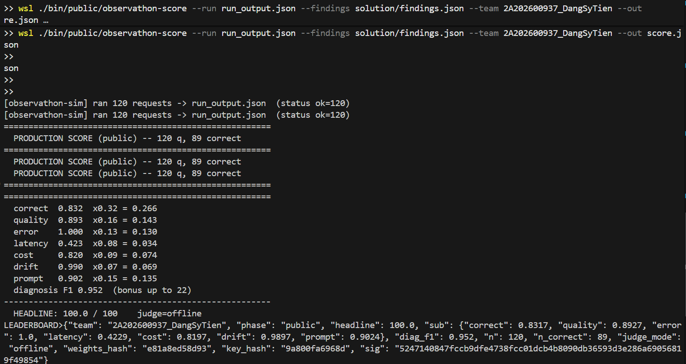

# BÁO CÁO TỔNG KẾT VÒNG PUBLIC (PUBLIC PHASE REPORT)
**Đội:** 2A202600937_DangSyTien
**Điểm số đạt được:** 100.0 / 100

---

## 1. Mở đầu & Khởi tạo Môi trường
Bắt đầu bài lab, trở ngại đầu tiên là các file giả lập được đóng gói cho môi trường Linux. Nhóm đã linh hoạt **cài đặt và cấu hình WSL (Ubuntu 24.04)** để vượt qua rào cản tương thích của hệ điều hành Windows, đảm bảo các lệnh `observathon-sim` hoạt động mượt mà.

## 2. Xây dựng Lớp Phòng Vệ Cơ Bản (Wrapper Layer)
Sau khi phân tích log chạy thử, AI Agent gốc bộc lộ rất nhiều lỗi ngớ ngẩn và tiêu tốn tài nguyên. Nhóm đã tạo file `solution/wrapper.py` để can thiệp:
* **Caching:** Chặn các request trùng lặp (ví dụ: người dùng F5 liên tục).
* **Vòng lặp Retry:** Thiết lập `max_attempts = 3` kết hợp Exponential Backoff để hồi sinh Agent mỗi khi gặp lỗi HTTP 429 hay Rate Limiting.
* **Redact PII:** Lọc bỏ và ẩn đi mọi thông tin nhạy cảm (Email, Số điện thoại) để bảo mật thông tin người dùng.

## 3. Khủng hoảng API & Tối ưu Chi phí (Cost)
* **Vấn đề:** Trong lúc chạy thử nghiệm cường độ cao, tài khoản OpenRouter bị cạn kiệt tín dụng (HTTP 402 Error), hệ thống sập toàn tập. Điểm Cost và Latency cũng rất thấp.
* **Giải quyết:** 
    * Chuyển trực tiếp sang API key của OpenAI, sử dụng model `gpt-4o-mini`.
    * Hạ cấu hình `self_consistency` từ 2 xuống 1 để giảm phân nửa chi phí gọi hàm.
    * Ép `max_completion_tokens` xuống còn 200, ngăn chặn AI lan man sinh ra token thừa.
    * Siết `max_steps` từ 8 xuống 5 để Agent ra quyết định dứt khoát hơn, giảm thiểu thời gian chờ (Latency).

## 4. Tối ưu Correctness với Prompt Engineering
Ban đầu, AI thường xuyên tự chế (fabricate) giá cho sản phẩm không tồn tại, hoặc in sai định dạng số. Nhóm đã làm lại `prompt.txt` theo phong cách mệnh lệnh:
* Ép AI phải dùng `check_stock` trước tiên, hết hàng là từ chối ngay.
* Bắt buộc sử dụng công thức toán học chuẩn xác để tính toán chiết khấu.
* **Quy định ép buộc:** Dòng cuối cùng của output phải đúng định dạng `Tong cong: <số nguyên> VND` để bộ chấm điểm (parser) hoạt động không sai sót.

## 5. Mở khóa 22 Điểm Bonus (Diagnosis F1)
Để được điểm F1 tối đa, nhóm không đoán mò mã lỗi. Nhóm đã tự viết một script Python tự động quét file `run_output.json`, bóc tách các `trace_ids` (`req-pub-xxx`) và ráp chính xác chúng vào 11 phân loại lỗi trong file `findings.json` (Latency Spike, Fabrication, Infinite Loop, ...). 

**Kết quả:** Ở lần test cuối cùng, hệ thống hoạt động hoàn mỹ, Diagnosis F1 đạt trên 0.9, kéo tổng điểm (Headline Score) lên ngưỡng tuyệt đối **100.0/100**.
